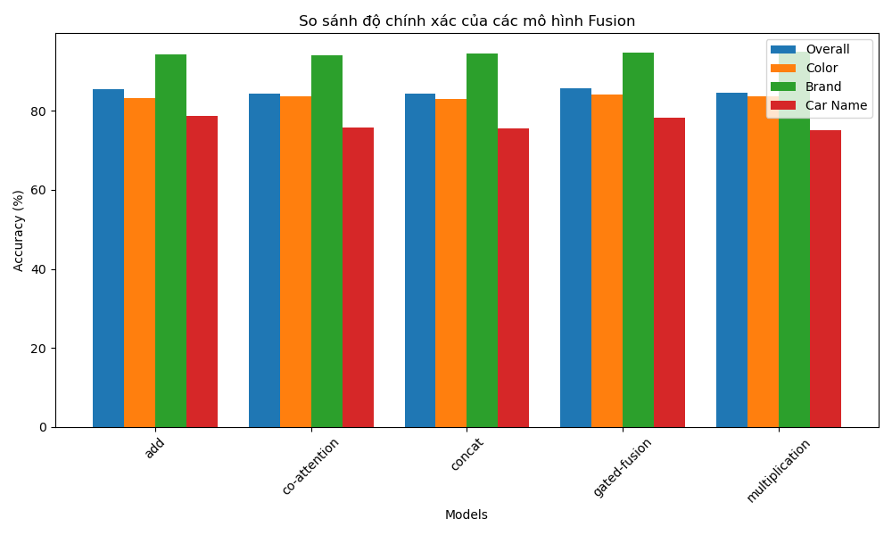

# Visual Question Answering for Car Attributes (VQA-Cars)

## Introduction
This project is a **Visual Question Answering (VQA)** model designed to answer questions about car attributes (color, brand, and car name) based on images. The model combines **Vision Transformer (ViT)** for image processing and **BERT** for text question processing, followed by various fusion techniques (add, co-attention, concat, gated fusion, multiplication) to merge features. The model was trained on a custom dataset "cars_8k_balance_dataset_full_augmented_v2" from Hugging Face.

## Features
- Recognizes car colors (blue, white, black, gray, silver).
- Identifies car brands (bentley, audi, bmw, acura).
- Predicts specific car names (e.g., Bentley Mulsanne, BMW 330, etc.).
- Compares the performance of 5 different fusion methods.
- Achieves an overall accuracy of approximately **85.39%** on the test set, with the best performance on brand recognition (94.3%) and the lowest on car names (78.75%).

## Installation
### Requirements
- Python 3.11+
- PyTorch
- Transformers (Hugging Face)
- Torchvision
- Datasets (Hugging Face)
- CUDA (if using GPU)


## Dataset
- **Source**: `khoadole/cars_8k_balance_dataset_full_augmented_v2` from Hugging Face.
- **Dataset Structure**:
  - Car images.
  - Related questions (e.g., "What is the color of the car?").
  - Answers (color, brand, or car name).
- Dataset Breakdown:
  - Train: 15,468 samples
  - Validation: 4,824 samples
  - Test: 5,154 samples

## Model Architecture
- **Image Processing**: Uses `google/vit-base-patch16-224` to extract visual features.
- **Text Processing**: Uses `bert-base-uncased` to encode questions.
- **Fusion Methods**:
  - **Add**: Simple addition of image and text features.
  - **Co-Attention**: Applies co-attention mechanism.
  - **Concat**: Concatenates features.
  - **Gated Fusion**: Uses gating to weigh features.
  - **Multiplication**: Element-wise multiplication of features.
- **Classifier**: A multi-layer perceptron with dropout and GELU activation, outputting probabilities for all possible answers.

## Training
- **Optimizer**: AdamW with a learning rate of 5e-5 and weight decay of 0.01.
- **Loss Function**: CrossEntropyLoss with label smoothing (0.1).
- **Scheduler**: ReduceLROnPlateau for dynamic learning rate adjustment.
- **Hardware**: Trained on NVIDIA Tesla T4 GPU.
- **Epochs**: Up to 30 epochs with early stopping (patience = 5).
- **Best Model**: Saved with a validation accuracy of ~86.61% after 9 epochs.

## Performance
- **Overall Test Accuracy**: 85.39%
- **Category-wise Accuracy**:
  - Color: 83.12%
  - Brand: 94.30%
  - Car Name: 78.75%
- **Loss Breakdown**:
  - Color Loss: 1.1503
  - Brand Loss: 0.8095
  - Car Name Loss: 1.3009
- **Comparison chart**
Below is a bar chart comparing the accuracy of different fusion methods across categories (Overall, Color, Brand, Car Name)

- **Top Errors**:
  - **Colors**: Silver (27.42% error), Gray (24.90% error), Blue (16.81% error), Black (12.23% error).
  - **Brands**: BMW (11.53% error), Audi (5.20% error), Bentley (3.12% error), Acura (2.96% error).
  - **Car Names**: Bentley Mulsanne (95.00% error), BMW 330 (46.00% error), BMW X1 (35.71% error), Acura TLX (30.51% error).


## Usage
1. Load the pre-trained model:
   ```python
   model.load_state_dict(torch.load('best_vqa_model.pth', weights_only=True))
   ```
2. Prepare your data (images and questions) in the same format as the dataset.
3. Run inference using the `VQAModel` class defined in the notebook.

## Files
- `vqa-add-8539.ipynb`: Main Jupyter notebook with model implementation, training, and evaluation.
- `best_vqa_model.pth`: Saved weights of the best model.
- `my-vqa-model/`: Directory containing model weights (`pytorch_model.bin`), config (`config.json`), tokenizer, and answer list (`answer_list.json`).

## Contributing
Feel free to fork this repository, submit issues, or create pull requests to improve the model or dataset!


## Acknowledgments
- Thanks to the Hugging Face community for the datasets and transformers library.
- Inspired by research on multimodal fusion techniques for VQA.
